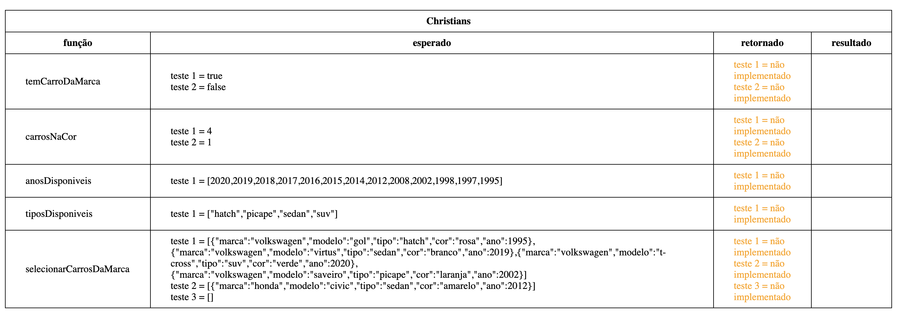
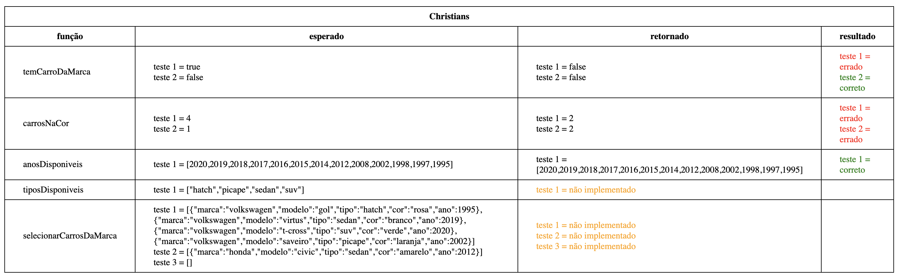

# Atividade Carros

### Considere que temos um array de carros contendo as informações de marca, modelo, tipo, cor e ano. Faça um algoritmo (função) que tenham as seguintes lógicas:

1. Receba um parâmetro informando o nome de uma marca, por exemplo "renault", e retorne se existe um carro dessa marca no array
2. Receba um parâmetro informando uma cor, por exemplo "branco", e retorne quantos carros dessa cor existem no array
3. Retorne um array com todos os anos que tem carros produzidos em ordem decrescente
4. Retorne um array com todos os tipos de carros que existem
5. Receba um parâmetro informando o nome de uma marca, por exemplo "fiat", e retorne um array com todos os carros da marca informada (observação deve retornar na mesma ordenação original do array recebido)

Ao abrir o arquivo `testes.html` no navegador você poderá ver uma tabela com o seu nome e o resultado dos testes das suas funções conforme na imagem abaixo:



Ao implementar as funções corretamente no arquivo com o seu nome, por exemplo, no caso do Christians no arquivo `christians.js` você passará a ver a tabela no navegador com a coluna resultado preenchida com o retorno da sua função e se o teste está correto ou errado, conforme imagem abaixo:



Dentro do arquivo javascript com o seu nome você encontrará 5 funções `temCarroDaMarca`, `carrosNaCor`, `anosDisponiveis`, `tiposDisponiveis` e `selecionarCarrosDaMarca`. Onde cada uma delas deverá ser implementado um algoritmo para fazer o que está descrito nos passos 1 à 5 (acima). Exemplo do conteúdo do arquivo com seu nome:

```javascript
export const nome = "jefferson";

export function temCarroDaMarca(carros, marca) {
  // coloque aqui o algoritmo para retornar um boolean (true ou false)
  // se existir um carro com a marca informada ou não
  return null;
}

export function carrosNaCor(carros, cor) {
  // coloque aqui o algoritmo para retornar a quantidade
  // de carros na cor recebida como parâmetro
  return null;
}

export function anosDisponiveis(carros) {
  // coloque aqui o algoritmo para retornar um array de number
  // com os anos disponíveis nos carros informados
  return null;
}

export function tiposDisponiveis(carros) {
  // coloque aqui o algoritmo para retornar um array de strings
  // com os tipos disponíveis nos carros informados
  return null;
}

export function selecionarCarrosDaMarca(carros, marca) {
  // coloque aqui o algoritmo para retornar um array de object
  // com os carros da marca informado como parâmetro
  return null;
}
```

Os dados que estarão no array carros recebidos como parâmetro nas funções são esses:

```javascript
const carros = [
  {
    marca: "chevrolet",
    modelo: "onix",
    tipo: "hatch",
    cor: "verde",
    ano: 2014,
  },
  {
    marca: "chevrolet",
    modelo: "onix plus",
    tipo: "sedan",
    cor: "vermelho",
    ano: 2020,
  },
  {
    marca: "chevrolet",
    modelo: "s-10",
    tipo: "picape",
    cor: "vermelho",
    ano: 1998,
  },
  { marca: "volkswagen", modelo: "gol", tipo: "hatch", cor: "rosa", ano: 1995 },
  {
    marca: "volkswagen",
    modelo: "virtus",
    tipo: "sedan",
    cor: "branco",
    ano: 2019,
  },
  {
    marca: "volkswagen",
    modelo: "t-cross",
    tipo: "suv",
    cor: "verde",
    ano: 2020,
  },
  {
    marca: "volkswagen",
    modelo: "saveiro",
    tipo: "picape",
    cor: "laranja",
    ano: 2002,
  },
  { marca: "fiat", modelo: "strada", tipo: "picape", cor: "preto", ano: 2008 },
  { marca: "fiat", modelo: "toro", tipo: "picape", cor: "preto", ano: 2017 },
  { marca: "renault", modelo: "kwid", tipo: "hatch", cor: "branco", ano: 2018 },
  { marca: "ford", modelo: "ka", tipo: "hatch", cor: "cinza", ano: 1997 },
  { marca: "ford", modelo: "ka sedan", tipo: "sedan", cor: "verde", ano: 2016 },
  {
    marca: "toyota",
    modelo: "corolla",
    tipo: "sedan",
    cor: "vermelho",
    ano: 2014,
  },
  {
    marca: "toyota",
    modelo: "hilux",
    tipo: "picape",
    cor: "vermelho",
    ano: 2015,
  },
  { marca: "hyundai", modelo: "hb20", tipo: "hatch", cor: "azul", ano: 2008 },
  {
    marca: "hyundai",
    modelo: "hb20s",
    tipo: "sedan",
    cor: "branco",
    ano: 2019,
  },
  { marca: "hyundai", modelo: "creta", tipo: "suv", cor: "branco", ano: 2017 },
  { marca: "jeep", modelo: "renegade", tipo: "suv", cor: "amarelo", ano: 2008 },
  { marca: "jeep", modelo: "compass", tipo: "suv", cor: "azul", ano: 2016 },
  { marca: "honda", modelo: "civic", tipo: "sedan", cor: "amarelo", ano: 2012 },
  { marca: "nissan", modelo: "kicks", tipo: "suv", cor: "amarelo", ano: 2016 },
];
```

Para a realização dessa atividade vocês precisaram criar variáveis (usando `const` e `let`), utilizar laços de repetição para iterar no array (`for`), estrutura de decisões com `if`, além de trabalhar muito na lógica do problema 😁

Dica: as funções estão ordenadas em ordem de dificuldade, então começe implementando pela mais "fácil/simples" primeiro e conforme for conseguindo passe para a próxima, não tente fazer tudo de uma só vez.